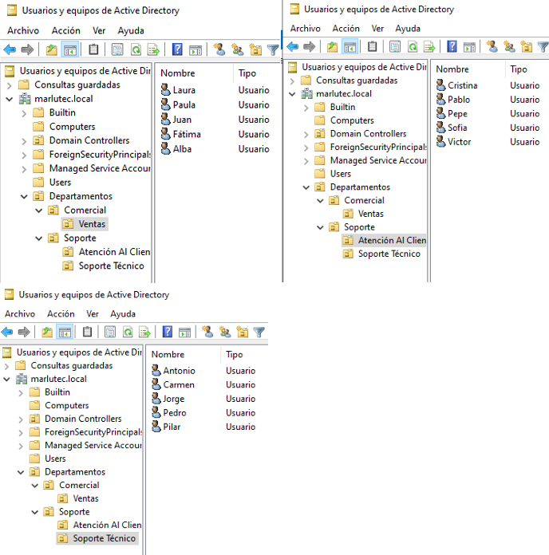
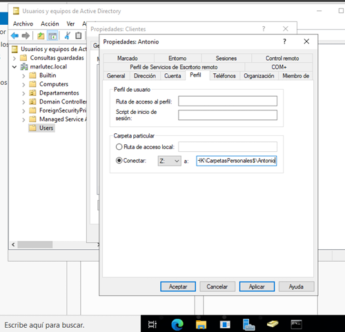
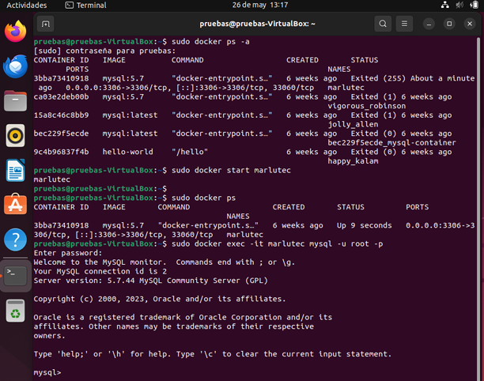
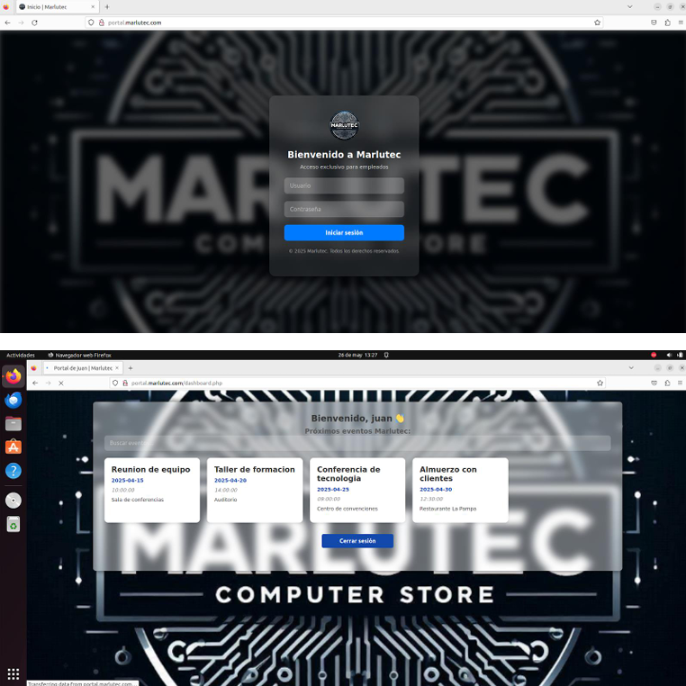
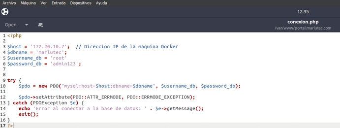
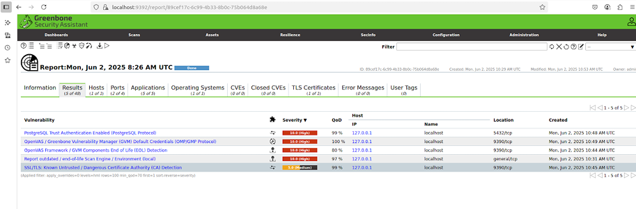
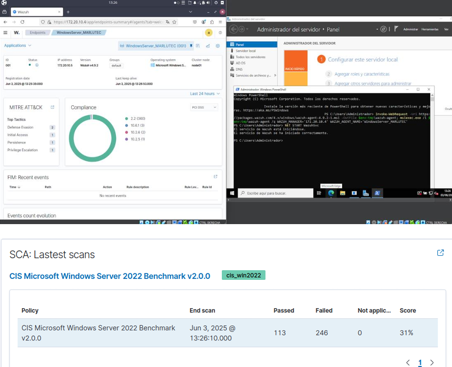

# Implementación Integral de Infraestructura IT – Proyecto Final ASIR

Este proyecto corresponde al diseño e implementación completa de una infraestructura IT corporativa.  
Incluye red segmentada, Active Directory, DNS, DHCP, páginas web, portal interno, base de datos en Docker, y seguridad con Wazuh y Greenbone.

**Memoria completa del proyecto:**  
[Descargar PDF](./Memoria%20Proyecto%20-%20Jose%20Martínez%20y%20Jose%20Luis%20Sánchez%202º%20ASIR.pdf)

---

## Tecnologías Utilizadas
- Windows Server (AD DS, GPOs)
- Ubuntu Server (DNS BIND9, DHCP)
- Docker + MySQL
- Apache / PHP
- Greenbone (OpenVAS)
- Wazuh SIEM
- Redes y VLAN
- Clientes Windows y Linux

---

## Infraestructura General

### Diagrama de Red

---

## Active Directory

### Organización por Departamentos

### GPO aplicada

### Carpetas personales

---

## Base de Datos en Docker

---

## Páginas Web

### Página corporativa

### Portal interno con login (PHP + MySQL)

---

## Seguridad

### Greenbone – Escaneo de vulnerabilidades

### Wazuh – Detección de eventos

---

## Vídeos de funcionamiento 
📁 Carpeta: `/capturas/videos-funcionamiento`

